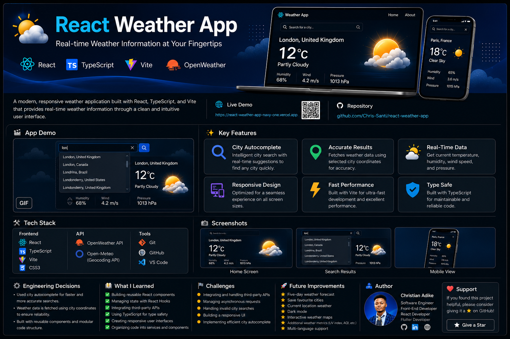
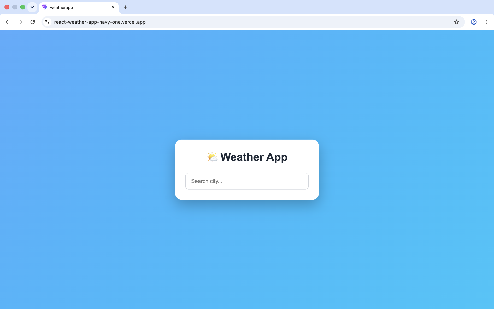
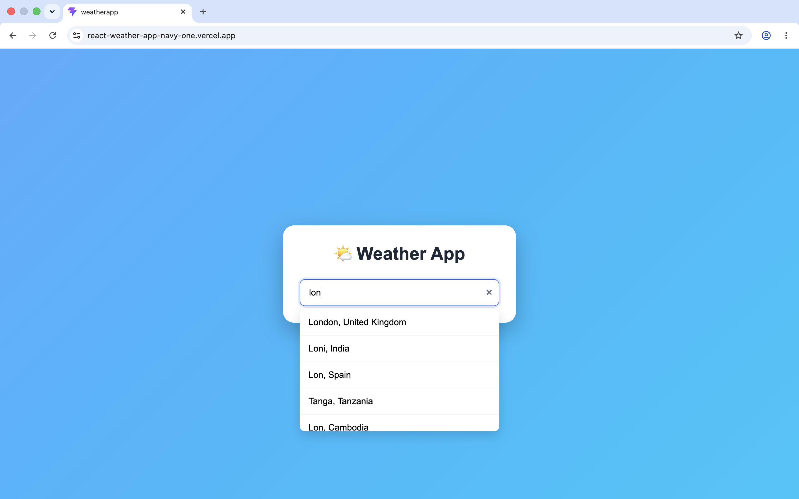
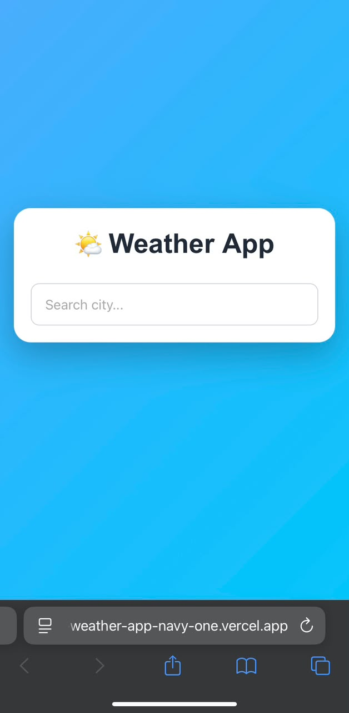

# React Weather App

<p align="center">
  
</p>


A modern, responsive weather application built with **React**, **TypeScript**, and **Vite** that provides real-time weather information through a clean and intuitive user interface.

---

# Live Demo

 **Live Application**

https://react-weather-app-navy-one.vercel.app

💻 **GitHub Repository**

https://github.com/Chris-Santi/react-weather-app

---

# Preview

## Home Screen



---

## Search Results



---

## Mobile View



---

# Features

- 🔍 Intelligent city autocomplete
- 🌍 Search weather by city
- 📍 Fetch weather using selected city coordinates
- 🌡 Real-time temperature display
- ☁️ Weather condition icons
- 💧 Humidity information
- 🌬 Wind speed display
- 📱 Fully responsive design
- ⚡ Fast performance powered by Vite
- 🚨 Graceful error handling for invalid searches

---

# Tech Stack

## Frontend

- React
- TypeScript
- Vite
- CSS3

## API

- OpenWeather API
- Open-Meteo Geocoding API *(if applicable)*

## Development Tools

- Git
- GitHub
- VS Code

---

# Project Structure

```text
react-weather-app/
│
├── docs/
│   └── screenshots/
│       ├── home.png
│       ├── search-results.png
│       └── mobile-view.png
│
├── public/
│
├── src/
│   ├── assets/
│   ├── components/
│   ├── services/
│   ├── types/
│   ├── App.css
│   ├── App.tsx
│   ├── index.css
│   └── main.tsx
│
├── README.md
├── package.json
├── tsconfig.json
└── vite.config.ts
```

---

# ⚙️ Getting Started

## Clone the repository

```bash
git clone https://github.com/Chris-Santi/react-weather-app.git
```

## Navigate to the project

```bash
cd react-weather-app
```

## Install dependencies

```bash
npm install
```

## Start the development server

```bash
npm run dev
```

The application will be available at:

```text
http://localhost:5173
```

---

# Engineering Decisions

### Why React + TypeScript?

React provides a component-based architecture for building reusable UI components, while TypeScript improves code quality through static typing and better developer tooling.

### Why City Autocomplete?

Instead of relying solely on manual text input, the application provides city autocomplete suggestions. Once a city is selected, the app retrieves its coordinates and uses them to fetch weather data, resulting in more accurate searches and an improved user experience.

### Performance Considerations

- Efficient API requests
- Reusable React components
- Lightweight Vite build
- Type-safe development with TypeScript

---

# Challenges

During development, I worked through several technical challenges, including:

- Integrating third-party weather APIs
- Managing asynchronous API requests
- Handling invalid search queries
- Building responsive layouts for multiple screen sizes
- Improving the search experience with city autocomplete

---

# What I Learned

This project strengthened my understanding of:

- React Hooks
- TypeScript
- API integration
- Component-based architecture
- Responsive web design
- State management
- Error handling
- Creating reusable services and components

---

# Future Improvements

- ⭐ Save favourite cities
- 📅 Five-day weather forecast
- 🌙 Dark Mode
- 📍 Current location weather
- 🌎 Interactive weather maps
- 🌐 Multi-language support
- 📊 Additional weather statistics

---

# Author

## Christian Adike

**Software Engineer | Front-End Developer | React Developer | Flutter Developer**

🌐 Portfolio  
https://adike-christian-portfolio.webflow.io/

💻 GitHub  
https://github.com/Chris-Santi

💼 LinkedIn  
https://linkedin.com/in/christian-adike-99709b321

---

# Contributing

Contributions, issues, and feature requests are welcome.

If you have suggestions for improving the project, feel free to fork the repository and submit a pull request.

---

# Support

If you found this project useful, please consider giving it a ⭐ on GitHub. It helps support my work and encourages future improvements.
